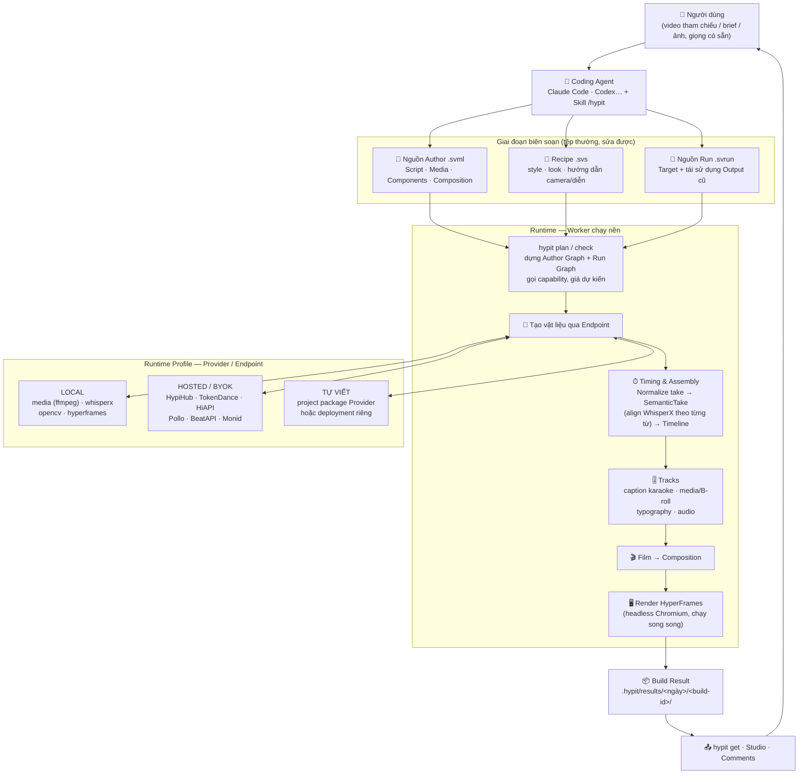
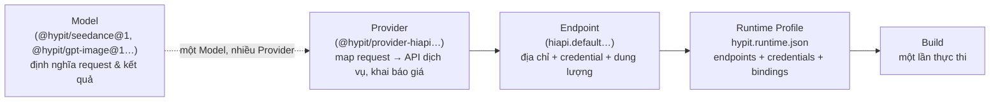

<p align="center">
  <picture>
    <source media="(prefers-color-scheme: dark)" srcset="./docs/public/hypit-logo-light.svg">
    
  </picture>
</p>

<h3 align="center">Clone mọi video viral bằng AI agent</h3>
<p align="center">1 lệnh, 100 biến thể, 100 triệu lượt xem.</p>

<p align="center">
  <a href="https://hypit.ai"><strong>Demo</strong></a>
  &nbsp;&bull;&nbsp;
  <a href="https://hypit.ai/quickstart/"><strong>Quickstart</strong></a>
  &nbsp;&bull;&nbsp;
  <a href="https://hypit.ai/guide/develop/"><strong>Develop</strong></a>
  &nbsp;&bull;&nbsp;
  <a href="./README.md"><strong>English</strong></a>
  &nbsp;&bull;&nbsp;
  <a href="./README.zh-CN.md"><strong>简体中文</strong></a>
</p>

> 📄 Đây là bản dịch tiếng Việt của [README.md](./README.md), bổ sung phần mô tả chi tiết workflow, hệ thống Provider/Model và hướng dẫn cài đặt đầy đủ để chạy được toàn bộ tính năng. Nội dung kỹ thuật gốc nằm trong [docs/](./docs) (tiếng Anh).

---

## Mục lục

1. [Hypit là gì](#hypit-là-gì)
2. [Các khái niệm cốt lõi](#các-khái-niệm-cốt-lõi)
3. [Workflow chạy của Hypit](#workflow-chạy-của-hypit)
4. [Hệ thống Provider và Model](#hệ-thống-provider-và-model)
5. [Cần cài đặt gì để chạy full tính năng](#cần-cài-đặt-gì-để-chạy-full-tính-năng)
6. [Hướng dẫn cài đặt chi tiết](#hướng-dẫn-cài-đặt-chi-tiết)
7. [Quy trình sản xuất một video](#quy-trình-sản-xuất-một-video)
8. [Cấu trúc dự án và các lệnh chính](#cấu-trúc-dự-án-và-các-lệnh-chính)
9. [Chi phí](#chi-phí)
10. [Ví dụ sử dụng](#ví-dụ-sử-dụng)
11. [Tài liệu, cộng đồng, đóng góp](#tài-liệu-cộng-đồng-đóng-góp)

---

## Hypit là gì

Hypit trao cho AI coding agent (Claude Code, Codex…) một **ngôn ngữ + hệ thống công cụ để làm video**.
Bạn đưa vào một video (hoặc một mô tả), agent sẽ "clone" lại toàn bộ workflow của nó: footage, caption,
B-roll, hiệu ứng — trong đó mọi thứ được **neo theo từng từ nói ra, không phải theo giây**.

**Làm rõ:** clone video chỉ là cách vào nhanh nhất, không phải cách duy nhất. Bạn có thể bắt đầu từ
template, hoặc đơn giản là mô tả video muốn làm và agent tự viết workflow từ đầu. Model sinh nội dung
cũng là tùy chọn: một workflow vẫn có thể dựng caption, motion graphics và hình ảnh render bằng code
thuần mà không cần gọi model sinh (tức là không tốn phí dịch vụ sinh).


<p align="center"><em>Mã SVML bên trái, video render trực tiếp bên phải.</em></p>

### Điểm mạnh

- **Clone mọi video:** đưa video vào, nhận về toàn bộ workflow — footage, caption, B-roll, hiệu ứng. Không chỉ là breakdown kịch bản.
- **Một workflow, 100 biến thể:** tái sử dụng composition và vật liệu đã có, chỉ sinh phần thay đổi.
- **Component tháo lắp được:** đổi người dẫn mà không phải sửa caption. Dùng thư viện sẵn có, fork hoặc tự viết.
- **Mã nguồn mở:** không tính phí theo ghế, không phí theo lần render, không đóng watermark. Chi phí model do dịch vụ bạn chọn tính.

### Hypit xây được những gì

- **Quảng cáo paid social** — clone quảng cáo thắng từ Meta Ad Library, thay sản phẩm, ra 50 biến thể hook trong ngày. Quảng cáo "hết nhiệt" thì chạy lại với opening mới, phần thân giữ nguyên.
- **Bản clone viral** — mọi TikTok/Reel/Short thành template: đổi host, hook, sản phẩm, ngôn ngữ, tỷ lệ khung hình.
- **Video TikTok Shop / affiliate** — một format đã convert, mỗi ngày một SKU mới: đổi sản phẩm, giá, CTA; cấu trúc đã hiệu quả giữ nguyên.
- **AI UGC, talking head** — lồng tiếng, caption cấp từ, B-roll, comment sticker, cắt theo beat — tự động kết nối với nhau.
- **Podcast & phỏng vấn** — layout chia đôi màn hình, caption phân biệt người nói, reaction overlay.
- **Video render bằng code** — hình ảnh điều khiển hoàn toàn bằng front-end code, render local, không gọi API sinh.
- **Bản địa hoá** — cùng một video ra mười ngôn ngữ. Viết lại một câu, timing tự chạy lại theo.

---

## Các khái niệm cốt lõi

| Khái niệm | Ý nghĩa |
|---|---|
| **SVML** (`.svml`) | Nguồn **Author**: mô tả video — Script (kịch bản theo ngữ nghĩa), media, component, composition |
| **SVS** (`.svs`) | **Recipe**: các giá trị thiết kế/tạo sinh tái sử dụng được (style caption, hướng dẫn camera, look…) |
| **SVRun** (`.svrun`) | Nguồn **Run**: chọn Target cần ra và tái sử dụng Output cũ (`build-record`, `satisfy`, `file`) |
| **Model** | Định nghĩa *cần sinh gì*: input, tham số, kiểu kết quả |
| **Provider** | Biết *làm thế nào* để hoàn thành request đó qua một dịch vụ/API cụ thể |
| **Endpoint** | Một Provider được cấu hình: địa chỉ dịch vụ, tham chiếu credential, dung lượng |
| **Runtime Profile** (`hypit.runtime.json`) | Chọn Endpoint + Credential Store + binding capability → Endpoint |
| **Run / Build** | Run là "ý định thực thi"; Build là *một lần thực thi* với graph + cấu hình đã chọn |
| **Build Result** | Kết quả công khai (Outputs), trạng thái và bằng chứng thực thi, lưu tại `.hypit/results` |
| **Worker** | Tiến trình nền giữ việc thực thi; đóng terminal không huỷ Build |
| **Studio / Comments** | Giao diện web xem trước timeline, sửa thuộc tính component, để phản hồi theo mốc thời gian |

> **Quan trọng:** Hypit **không có cache ngầm**. Tái sử dụng kết quả là *khai báo tường minh* trong `.svrun`
> (`build-record` + `satisfy`). Mỗi lần `hypit build` luôn tạo một Build id mới kể cả khi nguồn không đổi.

---

## Workflow chạy của Hypit

### Sơ đồ tổng quan kiến trúc



### Sơ đồ trình tự một phiên sản xuất

```mermaid
sequenceDiagram
    participant U as Người dùng
    participant A as Agent + Skill /hypit
    participant C as hypit CLI / Worker
    participant S as Dịch vụ model (Endpoint)

    U->>A: /hypit clone video này, thay sản phẩm/host…
    A->>C: hypit paths · runtime init · doctor
    A->>U: Giải thích dịch vụ cần, mức chuẩn bị local vs hosted
    U->>A: Chọn tài khoản dịch vụ + phạm vi ngân sách
    A->>C: hypit pricing &lt;run&gt; (báo giá)
    A->>C: hypit plan &lt;run&gt; (duyệt plan trước khi tốn tiền)
    A->>C: hypit build &lt;run&gt; --follow
    C->>S: Gọi model (ảnh · video · giọng · WhisperX)
    S-->>C: Media vật liệu
    C->>C: Normalize → SemanticTake → Timeline
    C->>C: Caption + Tracks → Film → Render MP4
    C-->>A: Build Result (các Output)
    A-->>U: Video hoàn chỉnh + mở Studio/Comments
    U->>A: Phản hồi / làm biến thể (tái sử dụng Output cũ)
```

### Sơ đồ quan hệ Model – Provider – Endpoint



### Các giai đoạn chạy, chi tiết

1. **Author (mô tả)** — Agent viết `.svml`: Script với các Segment/Selection/Moment theo *ý nghĩa* (không theo giây), khai báo media (`media:Image`, `media:Audio`), component sinh thế (`seedance:ReferenceVideo`, `gpt-image:*`…), caption, track và `film:Film`. Style/look nằm ở `.svs` (Recipe).
2. **Run (ý định thực thi)** — `.svrun` trỏ tới một Author Source, liệt kê `<target output="final.video"/>` và (tuỳ chọn) tái sử dụng Output của Build cũ bằng `<build-record>` + `<satisfy>`, hoặc đưa file có sẵn bằng `<file>`.
3. **Plan** — Compiler dựng **Author Graph + Run Graph**, cắt tỉa Operation không cần tới Target, liệt kê các request sinh bên ngoài + tham số + Endpoint đảm nhiệm + giá công bố. `plan` không gọi dịch vụ.
4. **Build & tạo vật liệu** — `hypit build` nộp việc cho Worker (chạy nền, độc lập terminal). Worker gọi các Endpoint: sinh video (Seedance…), sinh ảnh (GPT Image 2, Nano Banana, Grok Imagine, Seedream…), lấy word-alignment (WhisperX), xử lý media (FFmpeg), các phép biến đổi ảnh (OpenCV, xoá nền…).
5. **Timing & Assembly** — Mỗi take được `pipeline:Normalize` về một frame domain duy nhất, rồi `whisperx:SemanticTake` đối chiếu audio với đúng một Segment của Script → **SemanticTake**. Các SemanticTake ráp theo thứ tự bằng `time:Timeline`. Đây là "đồng hồ tự nhiên" để caption, graphic bám từ và B-roll ăn khớp với lời nói.
6. **Tracks & Film** — Mọi đóng góp âm thanh/hình ảnh là **Track ngang hàng** (không lồng nhau, z-order theo `stack-order`): caption (họ style `caption-fine`), media track / B-roll, typography, audio track. `film:Film` ghép các Track + Canvas + Timeline → **Composition**.
7. **Render** — `render-hyperframes` render Composition trên **headless Chromium** (ví dụ 64 tiến trình song song trong các demo chính thức) ra MP4.
8. **Result & duyệt** — Output ghi vào `.hypit/results/<UTC-date>/<build-id>/` (`result.json`, `files/`, `values/`). Dùng `hypit inspect` / `hypit get` để xem và export; mở Studio để sửa timeline/thuộc tính, Comments để phản hồi theo timestamp, rồi Build mới (tái sử dụng Output cũ) cho các sửa đổi.

> `build` **không** chuẩn bị môi trường: nó yêu cầu dependency đã sẵn sàng và từ chối trước khi nộp nếu thiếu.
> Việc chuẩn bị (cài npm package của adapter, tải chương trình ngoài, khởi động Worker) do `hypit runtime up` đảm nhiệm.

---

## Hệ thống Provider và Model

### Các Provider chính thức kèm trong Distribution

| Provider | Gói npm | Năng lực phục vụ | Kiểu kết nối |
|---|---|---|---|
| **HypiHub** ⭐ (khuyên dùng) | `@hypit/provider-hypihub` | Dịch vụ hosted tích hợp: sinh ảnh, sinh video, giọng nói và WhisperX qua **một tài khoản** | Đăng nhập (`hypit auth login`) |
| **TokenDance** | `@hypit/provider-tokendance` | Seedance 2.0/2.5, Seedream 5.0 lite, MiniMax H3 (giao thức Ark + MiniMax) | API key (BYOK) |
| **HiAPI** | `@hypit/provider-hiapi` | Seedance, Seedream 5.0 lite, MiniMax H3, GPT Image 2, Nano Banana, Grok Imagine | API key (BYOK) |
| **Pollo** | `@hypit/provider-pollo` | MiniMax H3, Grok Imagine 1.5, GPT Image 2, Nano Banana — media tham chiếu phải là **URL công khai** | API key (BYOK) |
| **BeatAPI** | `@hypit/provider-beatapi` | Seedance 2.0/2.5, MiniMax H3, Grok Imagine 1.5, GPT Image 2, Nano Banana (có upload media tham chiếu) | API key (BYOK) |
| **Monid** | `@hypit/provider-monid` | Seedance 2.0/2.5, MiniMax H3, ảnh Wan 2.7; mở rộng tool khác qua HTTP API của Monid | API key (BYOK) |

### Các Provider local (chạy trên máy bạn)

| Provider | Gói npm | Năng lực | Yêu cầu thêm |
|---|---|---|---|
| Local media | `@hypit/provider-media-local` | 9 phép xử lý byte media (trim, retime, tách stream, trích frame…) bằng `ffmpeg`/`ffprobe` | FFmpeg trên `PATH` |
| WhisperX local | `@hypit/provider-whisperx-local` | Transcribe + align cấp từ cho SemanticTake | Python 3.10–3.13, `uv`, tải model weights (lần đầu) |
| OpenCV local | `@hypit/provider-image-opencv-local` | Xử lý ảnh local (matting, biến đổi ảnh…) | Python (qua `uv`) |
| HyperFrames local | `@hypit/provider-hyperframes-local` | Render video từ composition bằng headless Chromium | Chromium tự tải bởi `hypit runtime up` |

### Các Model/Module dựng sẵn (một phần)

| Nhóm | Gói |
|---|---|
| Video sinh bằng AI | `@hypit/seedance` (TextVideo / FrameVideo / ReferenceVideo; model `mini`, `fast`, `standard`, `2.5`), `@hypit/minimax-h3`, `@hypit/wan`, `@hypit/pixverse` |
| Ảnh sinh bằng AI | `@hypit/gpt-image` (+ `gpt-image-kits`), `@hypit/nano-banana`, `@hypit/grok-imagine`, `@hypit/seedream` |
| Prompt Kits | `@hypit/seedance-kits` — 7 template "data-only" (speaker, broll, podcast, call, street-interview, motion-reference, camera-reference) |
| Giọng nói (TTS) | `@hypit/elevenlabs-speech`, `@hypit/fishaudio-speech`, `@hypit/mimo-speech` |
| Chuyển lời nói | `@hypit/whisperx`, `@hypit/speech`, `@hypit/speech-alignment`, `@hypit/speech-evidence` |
| Ảnh & media | `@hypit/image-transform`, `@hypit/image-compose`, `@hypit/background-removal`, `@hypit/volcengine-matting`, `@hypit/media-pipeline` |
| Caption & hiển thị | `@hypit/caption`, `@hypit/caption-fine`, `@hypit/comment-sticker`, `@hypit/deck-track`, `@hypit/typography-track`, `@hypit/screen-overlay`, `@hypit/ranking`, `@hypit/interview-emoji-reveal` |
| Trình chiếu & render | `@hypit/performance`, `@hypit/media-track`, `@hypit/audio-track`, `@hypit/sound`, `@hypit/film`, `@hypit/render-hyperframes`, `@hypit/hyperframes`, `@hypit/browser-capture`, `@hypit/yt-dlp` |
| Hạ tầng khác | `credential-store-env` / `-file` / `-os` / `-platform`, `build-result-fs` / `-s3`, `resource-store-fs` / `-s3`, `store-sqlite`, `runtime-local` |

### Mở rộng: thêm Model / Provider / deployment của riêng bạn

- **BYOK:** đưa API key của dịch vụ bạn đang dùng + tài liệu API của nó cho Agent — Agent sẽ viết gói Provider tương thích trong `packages/` của dự án (xem ví dụ [`examples/provider-package`](./examples/provider-package)).
- **Model mới:** phát triển package dựa trên `@hypit/hypit/model-kit`, `@hypit/hypit/generation`, `@hypit/hypit/author-kit` — khai báo cổng request, tham số, kiểu kết quả, capability.
- **Provider mới:** dùng `@hypit/hypit/endpoint-kit` (`defineEndpointPackage`, `AsyncEndpoint`, `CredentialRef`…). Tác vụ từ xa chuẩn gồm 3 action: `start` (nộp task + `checkpoint`), `poll` (`wakeAfter` để hẹn kiểm tra), `collect` (tải kết quả về `context.resources`).
- **Deployment riêng:** chạy model trên hạ tầng của bạn, rồi nối inference service vào qua Provider có sẵn (nếu cùng giao thức) hoặc Provider tự viết. Chi phí compute thuộc cloud của bạn; credit HypiHub không trả cho deployment này.

> Một Model có thể do nhiều Provider phục vụ; một Provider có thể phục vụ nhiều Model. Hai dịch vụ cùng
> một model vẫn có thể khác format request/giới hạn — Provider kiểm tra và báo sai lệch; lỗi dịch vụ
> **không** tự động đổi sang tài khoản khác.

---

## Cần cài đặt gì để chạy full tính năng

Bảng tổng hợp: muốn tính năng nào thì cần chuẩn bị gì.

| Tính năng / giai đoạn | Bắt buộc | Tùy chọn / thay thế |
|---|---|---|
| Cài Skill + CLI cơ bản | **Node.js 22.15+**, npm/npx | — |
| Clone video từ link nền tảng | `yt-dlp` (đi kèm hệ sinh thái) | Tự tải video về tệp |
| Tạo video bằng AI (Seedance, MiniMax H3, Wan…) | Tài khoản **HypiHub** *hoặc* key của TokenDance/HiAPI/Pollo/BeatAPI/Monid *hoặc* deployment riêng | Model `mini`/`fast` rẻ hơn `standard`/`2.5` |
| Tạo ảnh bằng AI (GPT Image 2, Nano Banana, Grok Imagine, Seedream) | Như trên (tùy model mỗi dịch vụ hỗ trợ) | Có thể bỏ, chỉ dùng ảnh tự chuẩn bị |
| Giọng nói / nhân vật nói (TTS) | HypiHub *hoặc* ElevenLabs / FishAudio / MiMo *hoặc* audio thu sẵn | `generate-audio="true"` của Seedance tự sinh tiếng |
| Transcribe + align cấp từ (caption karaoke, graphic bám từ) | **WhisperX local**: Python 3.10–3.13 + `uv` + tải model weights | *hoặc* WhisperX hosted trên **HypiHub** |
| Xử lý media (trim, tách, chuẩn hoá take) | **`ffmpeg` + `ffprobe`** trên `PATH` | Endpoint media tương thích khác |
| Biến đổi ảnh (matting, xoá nền…) local | Python qua `uv` (OpenCV) | Dịch vụ hosted có cùng capability |
| Render video cục bộ (HyperFrames) | **Chromium** (tự tải bởi `hypit runtime up`) | — |
| Video **không cần model sinh** (motion graphics, caption, code-render) | FFmpeg + Chromium là đủ — **0 đồng phí model** | — |
| Studio (preview + sửa timeline) | Trình duyệt; chạy `hypit studio --run <file.svrun>` (port mặc định `5179`) | `--locale-pack` để thêm ngôn ngữ giao diện |
| Lưu trữ Build Result | Mặc định: `.hypit/results` (local, `@hypit/build-result-fs`) | `hypit.results.json` → `@hypit/build-result-s3` (bucket S3) |
| Credential an toàn | Credential Store: `env` / `file` / `os` (Keychain, Credential Manager…) / `platform` | Không commit secret vào Source/Profile |
| Phát triển component/Provider mới | Thêm `pnpm 10.33` nếu làm việc trên chính repo Hypit | `pnpm check`, `pnpm test` |

> **Tóm lại, bộ tối thiểu để "chạy full":** Node.js 22.15+ · FFmpeg/ffprobe · Python 3.10–3.13 + `uv` (nếu dùng WhisperX/OpenCV local) · Chromium (auto) · **một** tài khoản model (HipiHub là đường tắt gọn nhất — một tài khoản cover ảnh + video + giọng + WhisperX) · một coding agent có hỗ trợ skill (Claude Code, Codex…).

---

## Hướng dẫn cài đặt chi tiết

### 1. Cài đặt Hypit Skill (một lần)

```bash
npx skills add hypit-ai/hypit -g
```

Lệnh này cài **Skill** (tri thức sản xuất cho agent). Lần dùng đầu tiên, agent sẽ kiểm tra **executable `hypit`**
và giúp chuẩn bị nếu thiếu. Dự án video của bạn có thể nằm ở bất kỳ đâu — không cần clone repo Hypit.

Skill, executable và dự án video có vị trí độc lập, cập nhật qua kênh riêng. Kiểm tra phiên bản:

```bash
hypit version --check
```

### 2. Cài các công cụ hệ thống

**macOS (Homebrew):**

```bash
brew install ffmpeg
brew install uv
ffmpeg -version && ffprobe -version && uv --version
```

**Windows (winget):**

```powershell
winget install --id Gyan.FFmpeg.Shared -e
winget install --id astral-sh.uv -e
ffmpeg -version; ffprobe -version; uv --version
```

**Linux:** dùng package manager của distro hoặc cách cài chính thức hiện hành của FFmpeg và `uv`.

Yêu cầu theo bảng gốc trong [Development Guide](./docs/guide/develop.md):

| Công cụ | Phiên bản | Dùng cho |
|---|---|---|
| Node.js | 22.15+ | mọi thứ (bắt buộc) |
| pnpm | 10.33.x | quản lý workspace khi phát triển repo Hypit |
| Python | 3.10–3.13 | WhisperX & OpenCV local |
| uv | mới nhất | quản lý môi trường Python |
| ffmpeg / ffprobe | stable gần nhất | xử lý media |
| Chrome / Chromium | `hypit runtime up` tự tải | render HyperFrames local |

> Node.js (+ npm) là yêu cầu cứng duy nhất. Các mục còn lại chỉ cần khi chạy Build thật.

### 3. Khởi tạo dự án video

```bash
cd /du/án/video-của-bạn
hypit paths              # xem Profile & vị trí trạng thái máy
hypit runtime init       # tạo hypit.runtime.json mẫu (không cài, không đăng nhập, không chạy)
hypit runtime use hypit.runtime.json
```

Profile khởi tạo đề xuất: **HipiHub** cho sinh nội dung + WhisperX, xử lý media và render local.
Chỉnh `hypit.runtime.json` theo dịch vụ bạn chọn. Ví dụ Profile chỉ dùng local:

```json
{
  "format": "hypit.runtime-local@1",
  "dataRoot": ".hypit/runtimes/local",
  "credentials": {},
  "endpoints": {
    "media.local": { "use": "@hypit/provider-media-local" }
  },
  "bindings": {}
}
```

Khi nhiều Endpoint cùng phục vụ một capability, dùng `bindings` để chỉ định route:

```json
"bindings": {
  "@hypit/whisperx@1#whisperx-alignment": "whisperx.local"
}
```

### 4. Chuẩn bị môi trường thực thi

```bash
hypit runtime up              # cài dependency adapter, chuẩn bị Managed Programs, khởi động Worker
hypit runtime status
hypit doctor                  # chẩn đoán cấu hình + credential (không tốn tiền, không sinh nội dung)
```

Các lệnh phụ: `hypit programs prepare|up|status|down` (quản lý chương trình ngoài như WhisperX),
`hypit runtime logs` (log Worker), `hypit doctor --endpoint <instance>` (chẩn đoán một Endpoint).

> Lần đầu chuẩn bị inference local có thể tải lượng dữ liệu lớn — hãy so sánh công sức đó với dùng
> dịch vụ hosted rồi hãy quyết định route trước khi bắt đầu tải.

### 5. Kết nối tài khoản model (credential)

```bash
hypit auth status hypihub.default    # xem Endpoint đã khai báo credential thế nào
hypit auth login hypihub.default     # kết nối tài khoản HypiHub
```

Với Endpoint khác, dùng input bảo mật mà Provider đó khai báo (ví dụ `hypit auth login images.personal`).
Credential theo biến môi trường thì set trong môi trường của Worker theo cấu hình Provider.

**Nguyên tắc:** không để secret trong Source `.svml`/`.svrun`, trong Profile hay trong tệp commit.
`doctor` chỉ kiểm tra *sự hiện diện* của credential, không in giá trị.

### 6. Cài thêm package khi cần

`check`/`plan` sẽ báo đúng lệnh cần chạy, ví dụ:

```bash
hypit packages install @fontsource-variable/inter@5.3.0
```

---

## Quy trình sản xuất một video

```text
/hypit Clone video: /path/to/video.mp4, thay phần ranking bằng so sánh Hypit với các sản phẩm AI video khác.
```

```text
/hypit Làm một video ranking đưa Hypit lên S tier.
```

Các bước (theo [Quickstart](./docs/quickstart.md)):

1. **Cài Skill** — `npx skills add hypit-ai/hypit -g`, mở dự án trong agent.
2. **Đưa tham chiếu + yêu cầu** — tệp video hoặc link, kèm ảnh mặt/sản phẩm/thương hiệu; giải thích phần muốn thay (host, sản phẩm, ngôn ngữ, tỷ lệ khung, CTA…). Agent xem video, đọc transcript, ghi "reference notes" vào dự án.
3. **Chọn dịch vụ** — Agent kiểm tra công cụ sẵn có; với video có lời nói, WhisperX cho word-timing. Chọn HypiHub (một tài khoản) hoặc BYOK, hoặc trộn local + hosted. Chọn tài khoản sinh khi đã rõ model cần dùng.
4. **Chốt chi phí rồi chạy** — Agent giải thích tài khoản, phạm vi, giá dự kiến (`hypit pricing`), bạn đồng ý ngân sách → `hypit plan` → `hypit build`. Agent dựng Script, hướng dẫn diễn, reference ảnh cho đúng ngay từ đầu; song song dựng caption/đồ hoạ.
5. **Xem & biến thể** — kiểm tra layout, caption, B-roll, timing; mở Studio để sửa; tiếp tục chat để làm biến thể — Output cũ được tái sử dụng tường minh trong `.svrun` mới.

---

## Cấu trúc dự án và các lệnh chính

### Cấu trúc dự án đề nghị (không bắt buộc)

```text
my-video/
  package.json              ranh giới dự án
  authors/
    main.svml               một entry Author
  recipes/
    visual.svs              Recipe thị giác
    generation.svs          Recipe sinh nội dung
  runs/
    images.svrun            một ý định thực thi
    final.svrun             ý định giao hàng cuối
  assets/                   media đầu vào do dự án sở hữu
  kits/                     Recipe Kit tự viết (tuỳ chọn)
  packages/                 component/Provider cục bộ (khi công việc cần)
  output/                   export tường minh cho người/công cụ khác
  hypit.runtime.json        môi trường thực thi
  hypit.results.json        tuỳ chọn: chọn nơi lưu Result (fs hoặc S3)
  .hypit/                   dữ liệu Runtime + Result sinh ra (nên gitignore)
```

`.gitignore` khuyến nghị cho dự án bên ngoài repo Hypit:

```text
.hypit/
output/
```

### Lệnh thường dùng

| Lệnh | Việc làm |
|---|---|
| `npx skills add hypit-ai/hypit -g` | Cài Hypit Skill cho agent |
| `hypit paths` | Vị trí Profile, trạng thái máy |
| `hypit runtime init` / `use` / `up` / `status` / `down` / `logs` | Vòng đời Runtime & Worker |
| `hypit programs prepare\|up\|status\|down` | Quản lý chương trình ngoài (WhisperX, FFmpeg…) |
| `hypit auth status\|login <endpoint>` | Xem/kết nối credential |
| `hypit doctor [--endpoint X]` | Chẩn đoán cấu hình & credential (không submit) |
| `hypit check <file.svml>` | Kiểm tra nguồn khi soạn thảo |
| `hypit plan <file.svrun>` | Xem công việc sẽ chạy, request sinh, Endpoint, `preflight` |
| `hypit pricing <file.svrun> [--json]` | Đọc giá của Provider cho Run đã chọn |
| `hypit measure main.svml --segment hook …` | Đo thời lượng phát âm (offline) để viết `duration` |
| `hypit build <file.svrun> [--title T] [--follow]` | Nộp Build (Worker chạy nền; `--follow` chỉ là quan sát) |
| `hypit status <build-id> [--watch]` / `hypit logs <build-id>` | Theo dõi / đọc log Build |
| `hypit cancel <build-id>` | Huỷ Build (best effort với task từ xa) |
| `hypit builds` / `hypit history <output>` / `hypit inspect <build-id>` | Duyệt Build Result cũ |
| `hypit get <build-id> --output final.video --to output/final.mp4` | Export một Output tường minh |
| `hypit studio --run build.svrun` | Mở Studio (preview + sửa) trên trình duyệt |
| `hypit packages install <pkg>` | Cài package author (font, kit…) |
| `hypit activity --verbose` | Xem capacity dùng chung + công việc đang chạy |

### Ví dụ `.svrun` tái sử dụng kết quả cũ

```svml
<?svml using="@hypit/run-markup@1"?>

<svrun version="1">
  <author source="./main.svml"/>
  <target output="final.video"/>

  <build-record id="hook-video"
    build="bld_20260902T142031123Z_0123456789" output="hook-take.video"/>
  <satisfy output="hook-take.video" candidate="hook-video"/>
</svrun>
```

Địa chỉ chính xác của một kết quả là cặp `build + output`. Muốn dùng file có sẵn:

```svml
<file id="approved-opening" type="@hypit/artifact@1#BlobArtifact"
  from="./approved-opening.mp4" media-type="video/mp4"/>
<satisfy output="opening-shot.video" candidate="approved-opening"/>
```

---

## Chi phí

- **Hypit miễn phí** (mã nguồn mở, [Hypit Open Source License](./LICENSE)): không phí theo ghế, không phí
  theo lần render, không watermark. Video bạn tạo ra thuộc về bạn.
- **Coding Agent và dịch vụ model** có tài khoản và cách tính giá riêng. Cài Skill/executable **không kèm
  credit sinh nội dung**. Một dự án có thể dùng dịch vụ khác nhau cho từng capability.
- Tham khảo từ các demo chính thức: video 18–26 giầy đầy đủ (A-roll + B-roll + caption + nhạc) giá
  **khoảng $1.07–$1.15** nhờ tái sử dụng vật liệu và render local.
- Trước khi chạy tốn tiền: `hypit pricing <run>` để xem request + giá công bố, đồng ý **tài khoản – phạm vi – ngân sách** với agent. Đăng nhập thành công hay còn số dư **không** phải là sự chấp thuận chi tiêu.

---

## Ví dụ sử dụng

| Thể loại | Nguồn | Ghi chú sản xuất |
|---|---|---|
| UGC – "GOAT DEBATE" (ranking bóng đá) | [`examples/ranking-football/reference.svml`](./examples/ranking-football/reference.svml) | [README](./examples/ranking-football/README.md) |
| Podcast – "DAILY CREATINE" | [`examples/podcast/reference.svml`](./examples/podcast/reference.svml) | [README](./examples/podcast/README.md) |
| Phỏng vấn đường phố – "NICE RIDE" | [`examples/interview/reference.svml`](./examples/interview/reference.svml) | [README](./examples/interview/README.md) |
| Dự án phức tạp (monorepo nhiều package) | [`examples/complex-explainer/`](./examples/complex-explainer/README.md) | [README](./examples/complex-explainer/README.md) |
| Composition theo ngữ nghĩa | [`examples/semantic-composition/`](./examples/semantic-composition/README.md) | [README](./examples/semantic-composition/README.md) |
| Tự viết Provider | [`examples/provider-package/`](./examples/provider-package/README.md) | [README](./examples/provider-package/README.md) |
| Package author tối thiểu | [`examples/minimal-author-package/`](./examples/minimal-author-package/README.md) | [README](./examples/minimal-author-package/README.md) |

Toàn bộ ví dụ: [`examples/README.md`](./examples/README.md).

---

## Tài liệu, cộng đồng, đóng góp

### Tài liệu

| Chủ đề | Đường dẫn |
|---|---|
| Quickstart cho người dùng agent | [docs/quickstart.md](./docs/quickstart.md) |
| Runs & Builds (thực thi, tái sử dụng) | [docs/quickstart/run.md](./docs/quickstart/run.md) |
| Media & Generation (Seedance, prompt kits) | [docs/quickstart/generation.md](./docs/quickstart/generation.md) |
| Timing & Assembly / Tracks / Film & Rendering | [timing](./docs/quickstart/timing.md) · [tracks](./docs/quickstart/tracks.md) · [composition](./docs/quickstart/composition.md) |
| Studio (preview, Comments) | [docs/quickstart/preview.md](./docs/quickstart/preview.md) |
| Dùng Hypit trong Agent | [docs/guide/agents.md](./docs/guide/agents.md) |
| Model & Provider (tự mở rộng) | [docs/guide/providers.md](./docs/guide/providers.md) |
| Dịch vụ model & deployment | [docs/guide/service-partners.md](./docs/guide/service-partners.md) |
| Runtime (Profile, Worker, Result) | [docs/guide/runtime.md](./docs/guide/runtime.md) |
| Phát triển (prerequisites, repo layout) | [docs/guide/develop.md](./docs/guide/develop.md) |

### Cộng đồng & đối tác

- Website: [hypit.ai](https://hypit.ai) · Discord: [discord.gg/85hnyQnxpn](https://discord.gg/85hnyQnxpn) · Telegram: [t.me/hypitai](https://t.me/hypitai) · X: [@hypitai](https://x.com/hypitai)
- Dịch vụ model/deployment đối tác: [HypiHub](https://hypit.ai) · [TokenDance](https://tokendance.space) · [HiAPI](https://www.hiapi.ai) · [Pollo API](https://api.pollo.ai) · [BeatAPI](https://beatapi.io) · [Monid](https://monid.ai)
- Đối tác môi trường Agent: [OpenAgents](https://openagents.org) · [AutoClaw](https://autoclaw.z.ai)
- Cộng đồng đối tác: [LINUX DO](https://linux.do/)

### Đóng góp

Pull request luôn được chào đón — tài liệu, ví dụ và bản dịch quan trọng ngang code. Xem
[CONTRIBUTING.md](./CONTRIBUTING.md) (bản tiếng Trung: [CONTRIBUTING.zh-CN.md](./CONTRIBUTING.zh-CN.md)) để biết
thiết lập, các bước CI và quy trình PR. Báo lỗi / đề xuất tính năng: mở
[Issue](https://github.com/hypit-ai/hypit/issues).

### Giấy phép

Hypit phát hành theo [Hypit Open Source License](./LICENSE). Video và các sản phẩm bạn tạo ra thuộc về bạn;
model và dịch vụ bên thứ ba có điều khoản riêng.
