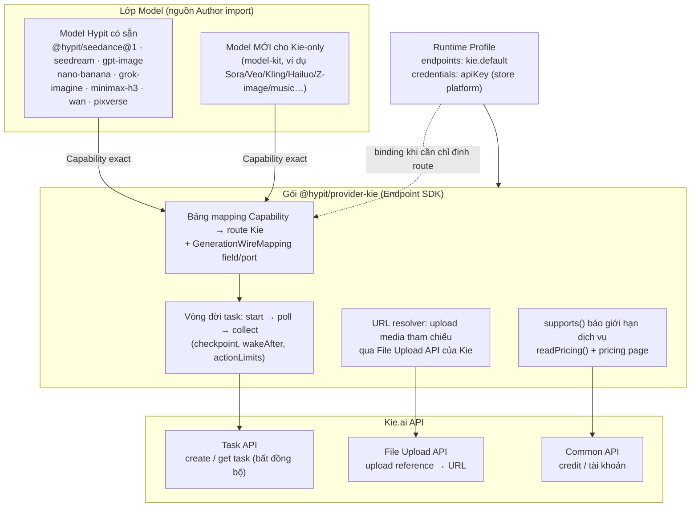
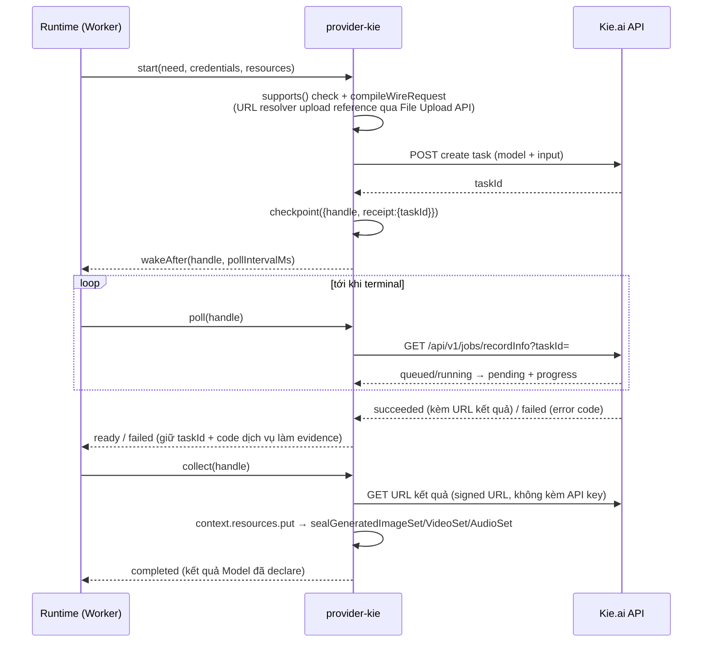

# Kế hoạch tích hợp Provider Kie.ai vào Hypit

> Tài liệu kế hoạch (tiếng Việt). Phạm vi: tích hợp **toàn bộ năng lực image, video, audio của Kie.ai**
> (bỏ qua chat/LLM) vào Hypit dưới dạng một Provider package chính thức hoặc project package, cộng với
> các Model package cần thiết. Tài liệu tham khảo API: <https://docs.kie.ai/market/quickstart>
> (File Upload API, Common API, AI Agents — Market).

---

## 1. Mục tiêu & phạm vi

| Trong phạm vi | Ngoài phạm vi |
|---|---|
| Provider package `@hypit/provider-kie` phục vụ mọi capability sinh media mà Kie.ai hỗ trợ (image, video, audio) | Chat / LLM / text-generation của Kie |
| Mapping các Model Hypit đã mô tả (Seedance, Seedream, GPT Image, Nano Banana, Grok Imagine, MiniMax H3, Wan, Pixverse…) sang route Kie tương ứng | Thay đổi Core/SDK của Hypit |
| Model package mới (`model-kit`) cho các model **chỉ có** trên Kie mà Hypit chưa mô tả | Các capability xử lý local (render, ffmpeg, OpenCV) — đã có Provider local, không thuộc Kie |
| Cấu hình Runtime Profile, credential (`hypit auth login`), pricing (`readPricing`), tài liệu README | CI/CD nội bộ của người dùng |

---

## 2. Kiến trúc tích hợp (tổng quan)



**Nguyên tắc thiết kế (theo boundary của Hypit):**

- **Model** giữ nguyên ý nghĩa request của tác giả (cổng, tham số, kết quả). Không đụng Model để vừa một
  dịch vụ — phần hẹp hơn của dịch vụ do Provider khai báo trong `supports()` (plan từ chối kèm lý do).
- **Provider** (`@hypit/provider-kie`) chỉ làm 3 việc: map request → wire format của Kie, quản lý vòng
  đời task, khai báo giới hạn + giá. Một package phục vụ **nhiều capability** (image + video + audio).
- **Endpoint** (`kie.default`) là một instance cấu hình: `baseUrl`, `apiKey` (CredentialRef),
  `pollIntervalMs`, `actionLimits`, `publicAssetUrl` (tuỳ chọn)…
- **Runtime Profile** chọn Endpoint và binding. Nguồn `.svml`/`.svrun` không biết Kie tồn tại.

---

## 3. Kho capability của Hypit cần phục vụ (mặt bằng hiện tại)

Đây là tập capability mà "full tính năng" của Hypit đang dùng — tích hợp Kie phải trả lời được
từng dòng trong bảng này (map sang Kie, hoặc kết hợp đường khác):

### 3.1 Sinh nội dung (Model → Capability exact)

| Capability | Nhóm | Kết quả | Ghi chú request |
|---|---|---|---|
| `@hypit/seedance@1#seedance-2` / `#seedance-2-fast` / `#seedance-2-mini` / `#seedance-2.5` | Video | `GeneratedVideoSet` | 3 shape: TextVideo / FrameVideo (first+last frame) / ReferenceVideo (ảnh+video+audio tham chiếu, `personReference`), `duration`, `resolution`, `aspectRatio`, `generateAudio`, `webSearch` |
| `@hypit/grok-imagine@1#grok-imagine-video` / `#grok-imagine-video-1.5-preview` | Video | `GeneratedVideoSet` | text-to-video / image-to-video |
| `@hypit/minimax-h3@1#minimax-h3` | Video | `GeneratedVideoSet` | ≤5 reference ảnh, 2K |
| `@hypit/pixverse@1#pixverse-v6` / `#pixverse-c1` | Video | `GeneratedVideoSet` | |
| `@hypit/gpt-image@1#gpt-image-2` | Image | `GeneratedImageSet` | text/image-to-image, ≤6 reference |
| `@hypit/nano-banana@1#nano-banana-2` / `#nano-banana-pro` | Image | `GeneratedImageSet` | |
| `@hypit/seedream@1#seedream-5-lite` | Image | `GeneratedImageSet` | t2i / i2i, quality basic/ultra |
| `@hypit/wan@1#wan-2.7-image` / `#wan-2.7-image-pro` | Image | `GeneratedImageSet` | |
| `@hypit/elevenlabs-speech@1#eleven_ttv_v3` | Audio | `GeneratedAudioSet` | Voice Design: mô tả giọng + speech sample → voice reference |
| `@hypit/fishaudio-speech@1#voice-design-1` / `#voice-clone` | Audio | `GeneratedAudioSet` | Voice Design + Voice Clone (text + voice ref → speech) |
| `@hypit/mimo-speech@1#mimo-v2.5-tts-voicedesign` / `#mimo-v2.5-tts-voiceclone` | Audio | `GeneratedAudioSet` | Tương tự trên (Xiaomi MiMo V2.5) |

### 3.2 Hạ tầng thực thi (không sinh nội dung — không thuộc phạm vi Kie)

| Capability | Vai trò | Đường phục vụ hiện có |
|---|---|---|
| `@hypit/whisperx@1#whisperx-alignment` | Transcribe + **align cấp từ** cho SemanticTake (neo caption/graphics theo từ) | `provider-hypihub` (hosted) hoặc `provider-whisperx-local` (**local, miễn phí**) |
| `@hypit/render-hyperframes@1#render-visual` / `#render-frames` | Render video/frames bằng Chromium | `provider-hyperframes-local` (local) |
| `@hypit/media-pipeline` (9 phép) | Normalize, trim, extract audio/frame… | `provider-media-local` (ffmpeg, local) |
| `@hypit/volcengine-matting@1#matte-portrait-video` | Tách nền video chân dung | `provider-hypihub` |
| `@hypit/background-removal@1#remove-background` | Tách nền 1 ảnh | Project Provider / OpenCV local |
| Image ops (compose/transform/matting) | Xử lý ảnh | `provider-image-opencv-local` (local) |

---

## 4. Thiết kế gói `@hypit/provider-kie`

### 4.1 Cấu trúc file (theo mẫu `examples/provider-package`, gộp 3 nhóm capability vào 1 package)

```text
packages/provider-kie/
  package.json               # devDep: @hypit/hypit (runtime-kit, endpoint-kit, generation)
  src/
    activation.ts            # defineEndpointPackage activation: config, credential slots, actionLimits
    provider.ts              # AsyncEndpoint dùng chung: start/poll/collect + checkpoint + cancel (nếu Kie có)
    routes.ts                # bảng route: capability → model Kie + endpoint task type + media limits
    mapping.ts               # GenerationWireMapping cho từng capability (fields, itemObject, whenAbsent)
    supports.ts              # rules từ chối trước submit (resolution/duration/khối lượng reference…)
    pricing.ts               # pricing page + readPricing (map request → rate của Kie)
    errors.ts                # map HTTP/task error của Kie → EndpointServiceError (giữ code, redact URL)
    upload.ts                # URL resolver: upload media qua File Upload API của Kie
  test/
    provider.test.ts         # lifecycle test với mock transport (không gọi API thật)
    mapping.test.ts          # assertMappingCoversPorts với port table của Model
```

### 4.2 Giao thức Kie.ai đã xác minh (điểm neo thiết kế)

| Nhóm API | Endpoint đã thấy trong docs | Dùng trong Provider |
|---|---|---|
| **Market (task)** | POST tạo task theo từng model (vd `Seedream5.0 Lite - Text to Image`) + GET trạng thái task | `start` / `poll` |
| **File Upload API** | `POST` Base64 Upload · `POST` File Stream Upload · `POST` URL File Upload | URL resolver: đưa media tham chiếu thành URL cho task input |
| **Common API** | `GET` Get Remaining Credits · `POST` Get Download URL for Generated Files · Webhook Security Verification | `collect` (lấy URL tải kết quả), `readPricing`/pre-flight (credit còn lại), webhook tuỳ chọn |
| **Xác thực** | API key (theo Getting Started) | Credential slot `apiKey`, `hypit auth login kie.default` |

> Lưu ý thiết kế: `POST Get Download URL for Generated Files` là bước **tách riêng** trước khi tải —
> khớp tự nhiên với tách `poll`/`collect` của Endpoint SDK (task xong ≠ bytes đã về).
> Kie có webhook (có xác minh chữ ký) — nếu triển khai nâng cao có thể dùng để wake thay vì poll,
> nhưng giai đoạn 1 giữ mô hình `poll` + `wakeAfter` cho đơn giản và đúng SDK.

### 4.3 Vòng đời task (bất đồng bộ — chuẩn của mọi model Kie)



Điểm bắt buộc theo Endpoint SDK:

- `start` trả về ngay khi Kie **nhận task** (không chờ render); `checkpoint` taskId **trước khi** trả về.
- `poll` trả `pending` + `wakeAfter(handle, delayMs)` khi `queued/running`; `ready` khi xong; `failed`
  kèm error code **của Kie**. Task `succeeded` mà thiếu URL = vi phạm hợp đồng dịch vụ → fail to, không im lặng.
- `collect` tải media qua signed URL, lưu qua `context.resources`, trả `sealGenerated*Set(...)` đúng
  kiểu Model declare. Download capacity tách khỏi task capacity (`actionLimits.collect`).
- `cancel` chỉ khai báo nếu Kie có endpoint hủy thật; nếu không thì không claim.
- `reportProgress` ở từng phase (chuẩn bị reference / submit / download) + `reportDiagnostic` cho evidence.

### 4.4 Media tham chiếu (URL resolver)

- Dùng `compileWireRequest(mapping, authored, resolver)` — resolver upload bytes qua **File Upload
  API** của Kie, trả URL dịch vụ, nên **không phần nào khác** biết giao thức upload của Kie.
- Map role → field wire theo đúng Model: `referenceImage` (kèm `personReference`) / `referenceVideo` /
  `referenceAudio` / `firstFrame` / `lastFrame`. Service không nhận được field nào thì `supports()`
  từ chối — **không bao giờ bỏ lặng field của tác giả**.
- Với item có field phụ (vd `personReference`), dùng `itemObject` + `fieldKeys` để field đi kèm URL;
  `assertMappingCoversPorts` kiểm tra khi load.
- `whenAbsent`: khai báo service nhận gì khi tác giả bỏ trống port tuỳ chọn.

### 4.5 `supports()` — báo hẹp hơn Model, không sửa Model

Ví dụ công thức (theo `examples/provider-package`):

```ts
function serviceSupport(request: EndpointRequest) {
  const ports = (request.constraints as unknown as GenerationRequest).ports;
  const duration = ports.duration?.[0];
  if (typeof duration === "number" && duration > KIE_MAX_SECONDS) {
    return { status: "unsupported" as const,
      reason: `Kie renders at most ${KIE_MAX_SECONDS} seconds, not ${duration}` };
  }
  // …resolution, số reference, định dạng… theo doc model trên Kie
  return mappingSupportsRequest(mapping, request.constraints)
    ? { status: "supported" as const }
    : { status: "unsupported" as const, reason: "…" };
}
```

Giới hạn media (dung lượng file, tổng reference, kiểu media) kiểm tra **trước khi** upload.

### 4.6 Credential & cấu hình Runtime Profile

```json
{
  "format": "hypit.runtime-local@1",
  "dataRoot": ".hypit/runtimes/local",
  "credentials": {
    "platform": { "use": "@hypit/credential-store-platform" }
  },
  "endpoints": {
    "kie.default": {
      "use": "@hypit/provider-kie",
      "pool": "kie.default",
      "config": {
        "apiKey": { "store": "platform", "key": "kie.api-key" },
        "defaultConcurrency": 3,
        "pollIntervalMs": 10000
      }
    }
  },
  "bindings": {}
}
```

- `hypit auth login kie.default` để nhập API key (Bearer) vào credential store đã chọn.
- `baseUrl` mặc định theo doc Kie; `requestTimeoutMs` / `operationTimeoutMs` / `actionLimits`
  (`submit`/`poll`/`collect` tách concurrency + rate) chặn HTTP call đơn và toàn bộ remote task.

### 4.7 Giá & quyền chi tiêu

- `pricing: { kind: "page", url }` → trang giá/credits của Kie; `readPricing` trả document hiện hành
  + `summary` (đơn vị credit, điều kiện) — **không** tự quy đổi sang tiền, không tính tổng.
- Nguyên tắc SDK: request ≠ giá niêm yết ≠ quyền chi tiêu. Việc đồng ý ngân sách thuộc người dùng/Agent.

---

## 5. Ma trận mapping Kie ↔ Hypit

Nguồn dữ kiện: [docs.kie.ai/llms.txt](https://docs.kie.ai/llms.txt) (toàn bộ danh mục model) + các
trang OpenAPI spec từng model (`*.md`). Base URL: `https://api.kie.ai`, auth `Authorization: Bearer <api-key>`.

### 5.1 Wire protocol Kie (Market — dùng chung cho mọi model)

| Hành động | Endpoint | Ghi chú |
|---|---|---|
| Tạo task | `POST /api/v1/jobs/createTask` — body `{ model, callBackUrl?, input }` → `{ code, msg, data: { taskId } }` | `start` của Endpoint |
| Trạng thái task | `GET /api/v1/jobs/recordInfo?taskId=...` (query **dùng chung mọi** model Market) | `poll`. State: `waiting` → `queuing` → `generating` → `success` / `fail` |
| Kết quả | `resultJson` (JSON string): `{resultUrls:[...]}`; Seedance + `return_last_frame` → thêm `firstFrameUrl/lastFrameUrl`; output text/mask → `{resultObject:{...}}`; kèm `failCode/failMsg`, `costTime`, `creditsConsumed` | `collect` |
| Link tải chính thức | `POST /api/v1/common/download-url` `{url}` → link tạm **20 phút** (chỉ nhận URL do Kie sinh) | dùng trong `collect` |
| Upload tham chiếu | `POST /api/file-base64-upload` (file nhỏ) · `POST /api/file-stream-upload` (multipart, file >10MB) · `POST` URL upload → `data.downloadUrl` (host `tempfile.redpandaai.co`, file tạm) | URL resolver |
| Credit | `GET` Get Remaining Credits (Common API) | pre-flight / `readPricing` |
| Webhook (tuỳ chọn) | `callBackUrl` khi tạo task + [Webhook Security Verification](https://docs.kie.ai/common-api/webhook-verification) | nâng cao thay poll |

Mã lỗi thống nhất: `200 · 401 · 402` (hết credit) `· 404 · 422` (sai tham số) `· 429` (rate limit)
`· 455` (bảo trì) `· 500 · 501` (generation fail) `· 505`. URL kết quả sinh **hết hạn ~24h** —
`collect` phải tải ngay. File upload tạm bị xoá tự động (24h–3 ngày theo doc — xác minh khi implement).
Khuyến nghị của Kie: poll backoff 2–3s tăng dần, dừng sau 10–15 phút.

> ⚠️ `createTask` **không có Idempotency-Key** (khác HiAPI). Theo Endpoint SDK: phân biệt rõ
> "chưa hề submit" với "đã submit nhưng chưa rõ kết quả" — `checkpoint` taskId ngay khi nhận,
> không tự submit lại mù quáng sau timeout (tránh nhân đôi chi phí credit).

### 5.2 Nhóm A — Capability Hypit đã mô tả → map thẳng sang Kie (KHÔNG cần Model mới)

| Capability Hypit | Model Kie (`model` field) | Điều kiện chọn route / ghi chú |
|---|---|---|
| `@hypit/seedance@1#seedance-2` | `bytedance/seedance-2` | |
| `@hypit/seedance@1#seedance-2-fast` | `bytedance/seedance-2-fast` | |
| `@hypit/seedance@1#seedance-2-mini` | `bytedance/seedance-2-mini` | |
| `@hypit/seedance@1#seedance-2.5` | `bytedance/seedance-2-5` | **Khớp gần hoàn hảo**: 3 scenario (first/last frame ↔ tham chiếu đa modal loại trừ lẫn nhau — đúng rule của Model), ≤30 ảnh / 10 video / 10 audio, `duration` 4–30 hoặc `-1`, 480p/720p/1080p, `generate_audio`, `web_search`. Không có field `personReference` → chấp nhận declaration, không truyền (như HiAPI) |
| `@hypit/minimax-h3@1#minimax-h3` | `minimax-h3/text-to-video` \| `image-to-video` \| `reference-to-video` | chọn route theo input thực tế |
| `@hypit/pixverse@1#pixverse-v6` | `pixverse/text-to-video` \| `image-to-video` \| `transition` (first+last frame) \| `reference-to-video` | `extend` (giãn video) là capability mới — xem Nhóm B |
| `@hypit/grok-imagine@1#grok-imagine-video` | `grok-imagine/text-to-video` \| `image-to-video` | |
| `@hypit/grok-imagine@1#grok-imagine-video-1.5-preview` | `grok-imagine/1-5-preview` | |
| `@hypit/gpt-image@1#gpt-image-2` | `gpt/gpt-image-2-text-to-image` \| `gpt/gpt-image-2-image-to-image` | |
| `@hypit/nano-banana@1#nano-banana-2` | `google/nanobanana2` | |
| `@hypit/nano-banana@1#nano-banana-pro` | `google/pro-image-to-image` | |
| `@hypit/seedream@1#seedream-5-lite` | `seedream/5-lite-text-to-image` \| `seedream-5-lite-image-to-image` | |
| `@hypit/wan@1#wan-2.7-image` | `wan/2-7-image` | |
| `@hypit/wan@1#wan-2.7-image-pro` | `wan/2-7-image-pro` | |
| `@hypit/background-removal@1#remove-background` | `recraft/remove-background` | ⭐ map được cả capability xử lý ảnh |
| `@hypit/pixverse@1#pixverse-c1` | — | ❌ Kie chỉ có V6 |
| `@hypit/elevenlabs-speech@1#eleven_ttv_v3` (Voice Design) | — | ❌ Kie có ElevenLabs **TTS** (turbo-2.5, multilingual-v2, dialogue-v3) nhưng không có `eleven_ttv_v3` text-to-voice |
| `@hypit/fishaudio-speech@1#voice-design-1` / `#voice-clone` | — | ❌ Kie không có Fish Audio |
| `@hypit/mimo-speech@1#mimo-v2.5-tts-voicedesign` / `#voiceclone` | — | ❌ Kie không có MiMo |
| `@hypit/whisperx@1#whisperx-alignment` | — | ❌ **Kie hoàn toàn không có ASR / transcription / word-alignment** |
| `@hypit/volcengine-matting@1#matte-portrait-video` | — | ❌ Kie có Volcengine **lip-sync**, không có matting |

→ **14/20 generation capability map thẳng** (8 video + 6 ảnh — mọi thứ cho video clone cơ bản),
cộng thêm `remove-background` (xử lý ảnh) = **15 capability không cần Model mới**.
Phần "audio giọng nói" và "alignment" xử lý ở mục 6.

### 5.3 Nhóm B — Model Kie chưa có trong Hypit → viết Model package mới (`model-kit`)

Đây là phần "áp dụng **hết** khả năng Kie". Mỗi cụm = 1 package `@hypit/<model>@1` + Surface author +
mapping trong `provider-kie`. Ưu tiên theo giá trị với workflow video ngắn:

| Cụm | Model Kie (đại diện) | Ghi chú |
|---|---|---|
| **Audio — TTS / giọng** (ưu tiên 1) | `elevenlabs/text-to-speech-multilingual-v2`, `text-to-speech-turbo-2-5`, `text-to-dialogue-v3`, `google/gemini-*-tts` (2.5 Pro, 3.1/3.8 Flash, 3.8 Flash Lite) | Thay cho gap speech; output `GeneratedAudioSet` |
| **Audio — Music / SFX** (ưu tiên 1) | Suno: `generate-music`, `extend-music`, `cover-suno`, `generate-mashup`, `generate-persona`, `replace-section`, `boost-music-style`, `generate-lyrics`, `get-timestamped-lyrics`, `generate-sounds` (SFX), `separate-vocals` (stem), `generate-midi`, `convert-to-wav`, `create-music-video`, **Suno Voice** (custom voice: validate → generate → check) | **Hypit chưa có model nhạc nào** — giá trị mới lớn nhất của Kie; nhạc nền sinh được thay vì phải có asset sẵn |
| **Audio — tiện ích** | `elevenlabs/audio-isolation` | tách tiếng ồn |
| **Video — avatar / talking** (ưu tiên 2) | `infinitalk/from-audio`, `omnihuman-1-5`, `kling/ai-avatar-standard\|pro`, `volcengine/video-to-video-lip-sync` | audio → video người nói; lip-sync |
| **Video — model hot** (ưu tiên 2) | Kling (`v3-omni-*`, `kling-3-0`, `v3-turbo-*`, `motion-control*`, 2.6/2.5 Turbo/2.1), `wan/2-7-*`, `wan/3-0-video(-prime)`, Hailuo (`2-3-*`, `02-*`), HappyHorse (`text/image/reference-to-video`, `video-edit`, 1.1), `bytedance/seedance-1-5-pro`, `bytedance/v1-pro\|v1-lite-*`, **Sora** (`sora-2`, `sora-2-pro` — được spec `get-task-detail` nhắc tới như model Market, cần xác minh trang model) | |
| **Video — edit / upscale** (ưu tiên 3) | `grok-imagine/upscale`, `grok-imagine/extend`, `pixverse/extend`, `topaz/video-upscale`, `wan/2-2-animate-move\|replace`, `wan/2-7-videoedit` | |
| **Ảnh — model mới** (ưu tiên 3) | Seedream `4.0/4.5/5.0-pro/5.0-flash` + edit + layer-decomposition, `z-image`, `google/imagen4(-fast\|-ultra)`, `flux2/*`, `grok-imagine-image-2.0/*` (segment map/edit), `gpt/gpt-image-2-5-flare\|sunburst`, `gpt-image/1-5-*`, `qwen*`, `ideogram/*`, `recraft/crisp-upscale`, `topaz/image-upscale`, 4o image, Flux Kontext | Layer decomposition / segment map hữu ích cho B-roll & tách lớp |
| **Phân tích ảnh/video** (ưu tiên 2) | `omnihuman-1-5/subject-detection` (trả `mask_urls`), `human-identification` (`subject_status`) | Thay vai trò detect mặt/người (YOLO/Google Video Intelligence) trong component tracking của demo interview |
| API-passthrough riêng | Veo3.1 (`veo3-api/*`), Runway + Aleph (`runway-api/*`) | Khác chuẩn Market — client riêng trong cùng package hoặc tách `provider-kie-veo` |

*(Mỗi trang model trên docs là một OpenAPI spec đầy đủ — khi implement, đọc spec `.md` của đúng model
để lấy trường input; không đoán. Chuỗi `model` enum trong bảng trên lấy theo tên catalogue — phải đối
chiếu `enum` trong spec của từng trang trước khi viết `routes.ts`.)*

### 5.4 Lộ trình triển khai

| Giai đoạn | Nội dung | Công sức ước tính |
|---|---|---|
| **P0 — Chuẩn bị** | Đăng ký Kie, tạo API key; đọc spec các model mục tiêu; scaffold `packages/provider-kie` từ `examples/provider-package/packages/provider-videos`; đổi `providerModule.name` | 0,5–1 ngày |
| **P1 — Hạ tầng chung** | `kieClient` (Bearer, deadline, retry policy), `createTask/recordInfo/download-url/file-base64-upload/file-stream-upload`, `errors.ts` map mã lỗi, `start/poll/collect` + `checkpoint`/`wakeAfter`, `actionLimits` tách submit/poll/collect, lifecycle test với mock transport | 2–3 ngày |
| **P2 — Map Nhóm A** | 15 capability (14 generation + `remove-background`): `GenerationWireMapping` + `supports()` + `assertMappingCoversPorts` test theo port table của Model. Làm `seedance-2.5` trước (khớp contract nhất), rồi seedance-2 family → ảnh (gpt-image-2, nano-banana, seedream-5-lite, wan) → grok → minimax-h3 → pixverse-v6 → remove-background | 2–4 ngày |
| **P3 — Vận hành** | `readPricing` (credits + pricing page), README + ví dụ `hypit.runtime.json`, smoke test `hypit doctor/plan/pricing/build` với 1 request thật mỗi nhóm, bổ sung tài liệu service-partners | 1–2 ngày |
| **P4 — Nhóm B theo ưu tiên** | Model packages: (1) TTS + Suno music/SFX → (2) avatar/talking + Kling/Wan/Hailuo/HappyHorse + subject-detection → (3) ảnh mới + edit/upscale | mỗi cụm 1–3 ngày |
| **P5 — Nâng cao** | Webhook `callBackUrl` (xác minh chữ ký) thay poll; cache upload/`asset://` (nếu model nhận) cho reference tái sử dụng; streaming upload file lớn | tuỳ chọn |

**Tiêu chí nghiệm thu từng giai đoạn:**

- **P1 xong:** lifecycle test (start→poll→collect) xanh với mock transport cho đủ state
  (`waiting`/`queuing`/`generating`/`success`/`fail`) + test lỗi (401/402/422/429/501, timeout, task
  xong mà mất URL); **không một test nào gọi API thật**.
- **P2 xong:** `assertMappingCoversPorts` xanh cho đủ 15 capability Nhóm A; `hypit plan` trên một
  `.svrun` mẫu liệt kê đủ request + endpoint `kie.default`; `supports()` từ chối đúng giá trị ngoài
  giới hạn dịch vụ (có test riêng).
- **P3 xong:** `hypit auth login kie.default` + `hypit doctor --endpoint kie.default` xanh;
  `hypit pricing` đọc được rate; 1 smoke request thật **mỗi nhóm** (1 video, 1 ảnh, 1 audio) ra
  Output hợp lệ trong Build Result.
- **P4 xong (mỗi cụm):** Model package + Surface import được từ `.svml`, map qua `kie.default`,
  một smoke thật cho model đại diện.

### 5.5 Rủi ro & các điểm cần xác minh khi implement

| Rủi ro / điểm mờ | Bằng chứng | Cách xử lý |
|---|---|---|
| `createTask` không có Idempotency-Key | Không thấy trong spec đã khảo sát | `checkpoint` taskId ngay khi nhận; phân biệt "chưa submit" vs "không rõ kết quả"; không retry submit mù (tránh nhân đôi credit) |
| Thời hạn file upload **mâu thuẫn ngay trong một trang** Kie: "24h" vs "3 ngày" | Trang `upload-file-base-64` / `upload-file-stream` | `collect` tải ngay khi `success`; không dựa vào upload dài hạn; hỏi support nếu cần cache reference |
| Base URL upload không thống nhất: spec nói `api.kie.ai`, ví dụ curl dùng `kieai.redpandaai.co` | Trang File Upload API | Tách `uploadBaseUrl` trong Endpoint config; xác minh bằng 1 upload thật ngay ở P1 |
| URL kết quả hết hạn ~24h; `download-url` chỉ cho link tạm 20 phút | Get Task Details / download-url | `collect` chạy ngay; không để URL trong Output; lưu bytes qua `context.resources` |
| Một số model nhận media dạng `asset://` cạnh URL thường | Mô tả input vài model (chưa xác minh hết) | URL resolver mặc định dùng `downloadUrl` của upload API; `asset://` chỉ dùng khi spec model xác nhận |
| Không có endpoint hủy task trong docs đã khảo sát | llms.txt + Common API | Không khai báo `cancel` (tránh claim sai); `hypit cancel` giữ ở mức best-effort local |
| Docs nhánh Suno / Veo3.1 / Runway có banner "docs đang cập nhật" — API có thể đổi | llms.txt | Ưu tiên Nhóm A (ổn định) trước; đọc lại spec trước mỗi cụm P4; contract test pin wire shape |
| Giá tính bằng credit; mã `402` khi hết credit | Enum lỗi Common API | `readPricing` + kiểm tra credit trước batch lớn; map `402` thành failure rõ ràng, **không tự đổi tài khoản** |
| Chuỗi `model` enum ở bảng 5.2 suy từ tên catalogue | — | Đối chiếu `enum` trong spec từng trang trước khi viết `routes.ts` |
| URL trang giá của Kie chưa đối chiếu thực tế | — | Điền URL thật vào `pricing: { kind: "page", url }` ở P3 |

---

## 6. Trả lời: "Chỉ dùng Kie có đáp ứng full tính năng của Hypit đang làm không?"

### Kết luận ngắn

> **Đủ cho ~90% workflow, nhưng KHÔNG đủ 100% nếu hiểu "chỉ Kie" là dịch vụ cloud duy nhất.**
> **14/20 generation capability map thẳng**; phần thiếu nằm ở 3 điểm: **word-alignment (WhisperX)**,
> **các model giọng nói Voice Design/Clone cụ thể**, và **matting video chân dung**.
> Cụm **"Kie (mọi generation) + các chương trình local miễn phí sẵn có trong Hypit (WhisperX local,
> FFmpeg, Chromium)" thì ĐỦ FULL tính năng** cho đúng các demo hiện tại (UGC ranking, podcast,
> street interview) — không cần bất kỳ dịch vụ cloud nào khác.

### Chi tiết từng lát cắt

| Lát cắt tính năng của Hypit | Chỉ dùng Kie? | Giải pháp |
|---|---|---|
| Sinh video A-roll/B-roll (Seedance 2.0/2.5, MiniMax H3, PixVerse V6, Grok Imagine) | ✅ **Đủ** — map thẳng 8 capability | `provider-kie` |
| Sinh ảnh (GPT Image 2, Nano Banana 2/Pro, Seedream 5.0 Lite, Wan 2.7 Image/Pro) | ✅ **Đủ** — map thẳng 6 capability | `provider-kie` |
| Tách nền 1 ảnh | ✅ Đủ (`recraft/remove-background`) | `provider-kie` |
| Caption karaoke, graphic neo theo từ (SemanticTake) — **đặc sản của Hypit** | ❌ **Thiếu**: Kie không có bất kỳ ASR/transcription/word-alignment nào | **WhisperX local** (miễn phí, đi kèm Hypit qua `uv` + Python) hoặc HypiHub. Đây không phải "dịch vụ khác" — là chương trình local của chính Hypit. **Đã kiểm chứng chạy tốt trên máy tầm trung, `vi` có align model sẵn — xem mục 7** |
| Giọng nói: Voice Design + Voice Clone (`eleven_ttv_v3`, Fish Audio, MiMo V2.5) | ❌ Thiếu **đúng model**; ⚠️ **tương đương một phần**: Kie có ElevenLabs TTS / Gemini TTS (voice_id preset) và **Suno Voice** (tạo/clone âm sắc từ audio mẫu) — riêng **Voice Design từ mô tả văn bản chưa thấy** trên Kie | Model package mới (Nhóm B): TTS với voice_id / Suno Voice; phần "design giọng từ mô tả" cần xác minh thêm — nếu thiếu thì thay bằng voice preset hoặc audio mẫu tự thu |
| Matting video chân dung (`matte-portrait-video`) | ❌ Thiếu | Giữ HypiHub cho riêng capability này, hoặc thay `remove-background` từng frame + OpenCV local |
| `pixverse-c1` | ❌ (chỉ có V6) | Dùng `pixverse-v6` hoặc model khác |
| Render MP4, xử lý media, Studio preview | ✅ Không phụ thuộc cloud (Chromium + FFmpeg local, có sẵn) | — |
| Nhạc nền, SFX, nhạc theo beat (trước đây phải có asset sẵn) | ✅✅ **Vượt trội** — Suno music/SFX/lyrics/stem-separation là mảng Hypit chưa hề mô tả | Model package mới — mở workflow "tự sinh nhạc nền" |
| Video avatar từ audio, lip-sync, face/subject tracking | ✅✅ **Vượt trội** — Infinitalk, OmniHuman 1.5, Kling AI Avatar, Volcengine lip-sync, subject-detection (mask) | Model package mới — nâng cấp component tracking trong demo interview |

### Ba việc BẮT BUỘC nếu cam kết "Kie là dịch vụ cloud duy nhất"

1. **Bật WhisperX local** (Python 3.10–3.13 + `uv`, tải model weights, khai `alignmentLanguages`)
   — nếu không thì mất toàn bộ "neo theo từ", tức mất lõi của Hypit. Hướng dẫn cài đặt đầy đủ
   (đa ngôn ngữ `vi`, `en`, …) và kết quả kiểm chứng phần cứng: **mục 7**.
2. **Viết mới nhóm speech model** — ElevenLabs TTS / Gemini TTS / Suno Voice thay cho
   `eleven_ttv_v3` / Fish Audio / MiMo. Voice Clone (text + voice ref → speech) map được qua
   TTS + Suno Voice; riêng **Voice Design từ mô tả văn bản** cần xác minh Kie có hay không —
   nếu thiếu thì thay bằng voice preset hoặc audio mẫu tự thu (workflow vẫn chạy full).
3. **Thay đường matting video** (local hoặc giữ 1 capability lẻ trên HypiHub).

Với các demo chính thức (~$1.07–$1.15/video: Seedance 2 Mini + GPT Image 2 + WhisperX + render local):
"Kie (Seedance + GPT Image) + WhisperX local" reproduces **nguyên trạng** — không cần HypiHub.

---

## 7. Hạ tầng WhisperX local — kiểm chứng khả năng chạy & cài đặt đa ngôn ngữ

Phụ lục này trả lời câu hỏi "máy local có chạy nổi WhisperX không?" bằng **đo đạc thật** và quy
trình cài đặt đầy đủ cho đa ngôn ngữ (vi, en, …). Đây là thành phần bắt buộc của công thức
"Kie + local" ở mục 6.

### 7.1 Kết luận kiểm chứng trên máy thực (Windows 10 Pro, AMD)

| Hạng mục | Máy đo được | Yêu cầu của WhisperX local | Đạt? |
|---|---|---|---|
| CPU | AMD Zen 4 (Family 25 Model 68), 8 nhân/16 luồng | Mọi CPU x64; mặc định là cấu hình "máy tầm trung" | ✅ Dư |
| GPU | AMD Radeon Graphics (iGPU 2GB dùng chung) — **không CUDA** | Không bắt buộc (`cpu`/`int8` là mặc định) | ✅ |
| RAM | (không đọc được từ sandbox — cần ≥8GB, thoải mái ≥16GB; peak thực tế ~3–4GB) | ≥8GB | ⚠️ xác nhận |
| Đĩa | ~56–67GB trống | ~3–5GB (Python env + weights + align models) | ✅ |
| Công cụ | `uv` ✅, `ffmpeg`/`ffprobe` ✅, `py` ✅ | uv + FFmpeg + Python 3.10–3.13 (uv tự cấp Python) | ✅ |

Tải trọng thực tế **nhẹ hơn tưởng tượng**:

- Backend là **faster-whisper (CTranslate2)** chạy CPU thuần — không cần NVIDIA; README của Provider
  gọi thẳng cấu hình mặc định `small`/`cpu`/`int8`/batch 8 là *"modest-machine execution default"*.
- Xử lý **theo từng take** (audio 16 kHz mono, đoạn 5–30 giây của mỗi `SemanticTake`), không phải
  cả video một lượt. Zen 4 8 nhân + `small`/`int8`: mỗi take **vài giây**; video 30 giây ≈ dưới 1 phút.
- Service chạy **warm** (nạp model một lần, `defaultConcurrency: 1`) — không nạp lại model mỗi take.
- Với demo $1.07–$1.15 (Seedance 2 Mini + GPT Image 2 + render local), tổng tải CPU chỉ gồm align
  từng take + render Chromium — CPU này gánh thoải mái.

### 7.2 Ngôn ngữ hỗ trợ align trong `whisperx==3.8.6` (phiên bản được ghim)

Kiểm tra trực tiếp mã nguồn `whisperx/alignment.py` của đúng phiên bản ghim trong
[services/whisperx/pyproject.toml](../services/whisperx/pyproject.toml):

| Nguồn model align | Ngôn ngữ |
|---|---|
| `DEFAULT_ALIGN_MODELS_TORCH` (torchaudio) | `en`, `fr`, `de`, `es`, `it` |
| `DEFAULT_ALIGN_MODELS_HF` (Hugging Face) | `ja`, `zh`, `nl`, `uk`, `pt`, `ar`, `cs`, `ru`, `pl`, `hu`, `fi`, `fa`, `el`, `tr`, `da`, `he`, **`vi`** ← `nguyenvulebinh/wav2vec2-base-vi-vlsp2020`, `ko`, `ur`, `te`, `hi`, `ca`, `ml`, `no`, `nn`, `sk`, `sl`, `hr`, `ro`, `eu`, `gl`, `ka`, `lv`, `tl`, `sv`, `id` |

- **Tiếng Việt (`vi`) có sẵn** — model align là wav2vec2-**base** (rất nhẹ, ~360MB). Caption karaoke
  cấp từ cho video tiếng Việt hoạt động out-of-the-box.
- Ngôn ngữ ngoài bảng trên: service từ chối trước inference với lỗi
  `no default alignment model for language` (test `test_models.py` khẳng định hành vi này) — khi đó
  cần hosted WhisperX (HypiHub xử lý theo deployment của họ) hoặc tự bổ sung align model.
- Mã ngôn ngữ phải tường minh, viết thường 2–3 chữ cái (`vi`, `en`, `zh`…); **không** nhận `zh-CN`,
  tên ngôn ngữ hay `auto`. (Lưu ý riêng `zh`: WhisperX align theo ký tự; adapter của Hypit giữ nguyên
  các cửa sổ đó và map về Script — xem [whisperx README](../packages/whisperx/README.md).)

### 7.3 Cài đặt chi tiết (đa ngôn ngữ vi + en)

**Bước 1 — Công cụ hệ thống** (máy đã có `uv` + `ffmpeg`/`ffprobe` thì bỏ qua):

```powershell
# Windows
winget install --id astral-sh.uv -e
winget install --id Gyan.FFmpeg.Shared -e
```

```bash
# macOS / Linux
brew install uv ffmpeg     # macOS
uv --version; ffmpeg -version; ffprobe -version
```

**Bước 2 — Khai báo Endpoint WhisperX local trong `hypit.runtime.json`**:

```json
{
  "format": "hypit.runtime-local@1",
  "dataRoot": ".hypit/runtimes/local",
  "credentials": {
    "platform": { "use": "@hypit/credential-store-platform" }
  },
  "endpoints": {
    "whisperx.local": {
      "use": "@hypit/provider-whisperx-local",
      "config": {
        "expectedModel": "small",
        "expectedDevice": "cpu",
        "expectedCompute": "int8",
        "expectedBatchSize": 8,
        "alignmentLanguages": ["vi", "en"]
      }
    }
  },
  "bindings": {
    "@hypit/whisperx@1#whisperx-alignment": "whisperx.local"
  }
}
```

- `alignmentLanguages: ["vi", "en"]` = **lời hứa chuẩn bị** cho đúng các ngôn ngữ production cần
  (mỗi mã → một model align ~360MB + dữ liệu câu NLTK riêng). Thêm `"zh"`, `"ko"`… tương tự khi cần;
  bỏ bớt để giảm tải. Danh sách này **không** chọn ngôn ngữ thay tác giả — từng Take tự khai `language`.
- Máy khoẻ có CUDA thì đổi `expectedModel: "large-v3"`, `expectedDevice: "cuda"`,
  `expectedCompute: "float16"`, `expectedBatchSize: 4` (ví dụ trong README Provider — không phải cam
  kết mọi GPU đủ bộ nhớ). Máy không CUDA (như máy đo ở 7.1): **giữ `small`/`cpu`/`int8`**.
- RAM hạn chế: hạ `expectedBatchSize` xuống 4; take ngắn rõ tiếng có thể dùng `expectedModel: "base"`.

**Bước 3 — Chuẩn bị & khởi động**:

```bash
hypit programs prepare --runtime hypit.runtime.json --endpoint whisperx.local
hypit runtime up --runtime hypit.runtime.json --endpoint whisperx.local
hypit doctor --endpoint whisperx.local
```

Lần `prepare` tải (~3–5GB, một lần): Python distribution qua `uv`, gói Python theo lockfile
(`uv sync --frozen`), dữ liệu câu NLTK theo ngôn ngữ, **ASR weights** (small ~480MB), và
**align model của từng ngôn ngữ trong `alignmentLanguages`**. `/health` được kiểm trước khi dùng —
một service warm với cấu hình model/device/compute không khớp sẽ **bị từ chối nhận việc**.

Mạng Việt Nam chậm/chặn Hugging Face thì set trước khi prepare (theo
[provider README](../packages/provider-whisperx-local/README.md)):

```powershell
$env:HF_ENDPOINT = "https://hf-mirror.com"   # mirror Hugging Face (tuỳ chọn)
$env:HF_HOME     = "D:\hf-cache"             # dời cache model sang ổ D (tuỳ chọn)
# UV_PYTHON_INSTALL_MIRROR / UV_DEFAULT_INDEX cho mirror Python/uv
# Lưu ý: các biến này KHÔNG redirect downloader của NLTK
```

Thêm một ngôn ngữ vào cache **cùng lúc** chạy (không cần restart service):

```bash
# sửa "alignmentLanguages": ["vi", "en", "zh"] trong Profile rồi:
hypit programs prepare --endpoint whisperx.local
```

**Bước 4 — Dùng trong nguồn SVML** (mỗi Take khai đúng ngôn ngữ của nó):

```svml
<whisperx:SemanticTake id="opening" narrative={story}
  segment={story.segment.opening} media={opening-media.media} language="vi"/>

<whisperx:SemanticTake id="english-cta" narrative={story}
  segment={story.segment.cta} media={cta-media.media} language="en"/>
```

Take không có lời nói (Segment không có Token) thì **không** khai `language` — nhánh này không cần
WhisperX, không tốn inference:

```svml
<whisperx:SemanticTake id="pause" narrative={story}
  segment={story.segment.pause} media={pause-media.media}/>
```

**Bước 5 — Phân tích tham chiếu** (clone video có sẵn):

```bash
hypit transcribe source.mp4 --language vi --to transcript.json --runtime hypit.runtime.json
```

### 7.4 Chẩn đoán nhanh khi có sự cố

| Câu hỏi | Lệnh |
|---|---|
| Profile & vị trí trạng thái máy | `hypit paths` |
| Service WhisperX đã lên, đúng cấu hình chưa | `hypit doctor --endpoint whisperx.local` |
| Worker có đang chạy việc gì | `hypit runtime status` · `hypit runtime logs` |
| Chương trình ngoài (kể cả WhisperX) ở đâu, log nào | `hypit programs status --verbose` |
| Lỗi thường gặp | Sai `expected*` so với service đang warm → từ chối trước inference; thiếu align model của một ngôn ngữ mới thêm → chạy lại `programs prepare`; lỗi `no default alignment model` → ngôn ngữ ngoài bảng 7.2; cache hỏng → xem log service + chuẩn bị lại |

### 7.5 Dự phòng nếu cần nhanh hơn / chất lượng cao hơn

| Phương án | Cách làm | Chi phí |
|---|---|---|
| Hạ tải local | `expectedBatchSize: 4`, hoặc `expectedModel: "base"` cho take ngắn rõ | 0đ |
| **Hosted WhisperX (HypiHub)** — chỉ phần align | Đổi binding `"@hypit/whisperx@1#whisperx-alignment": "hypihub.default"` trong Profile — **không sửa gì khác** | Tính theo phút audio |
| Hybrid với Kie (đã chọn trong kế hoạch) | Kie lo sinh ảnh/video/giọng; WhisperX local lo align | 0đ phần align |

*(Máy "khoẻ/yếu" chỉ ảnh hưởng **tốc độ**, không ảnh hưởng khả năng chạy — cấu hình mặc định được
thiết kế cho máy tầm trung; các tác vụ nặng (sinh video/ảnh) đã dồn hết lên cloud Kie.)*

---

## 8. Tài liệu tham khảo đã dùng

- Kie: [Market quickstart](https://docs.kie.ai/market/quickstart) · [Getting Started](https://docs.kie.ai/1973359m0) · [llms.txt — danh mục model](https://docs.kie.ai/llms.txt) · [Get Task Details](https://docs.kie.ai/market/common/get-task-detail.md) · [Seedance 2.5 spec](https://docs.kie.ai/market/bytedance/seedance-2-5.md) · [File Upload API](https://docs.kie.ai/file-upload-api/quickstart) ([stream upload](https://docs.kie.ai/file-upload-api/upload-file-stream.md)) · [Common API](https://docs.kie.ai/common-api/quickstart) ([download-url](https://docs.kie.ai/common-api/download-url.md), [credits](https://docs.kie.ai/common-api/get-account-credits), [webhook verification](https://docs.kie.ai/common-api/webhook-verification))
- Hypit: [Endpoint SDK](../packages/endpoint-kit/README.md) · [Model SDK](../packages/model-kit/README.md) · [Provider example](../examples/provider-package/README.md) · [provider-hiapi](../packages/provider-hiapi/README.md) · [Providers guide](./guide/providers.md) · [Runtime](./guide/runtime.md) · [Runs & Builds](./quickstart/run.md)
